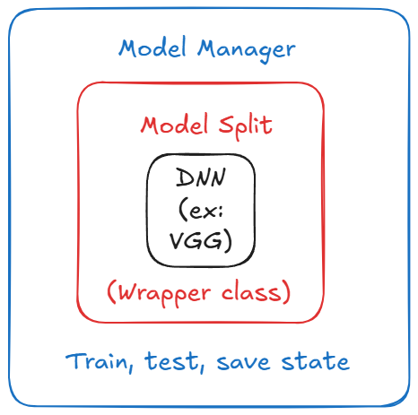

# Project Overview
The goal of this project is to create a Federated Learning strategy agnostic framework to be able to run smoothly any parameter-decoupling algorithm by only implementing the new strategy.
## Goals
- Run Centralised Federated Learning rounds with personalised models, specific aggregation/training strategy (e.g FedPer, FedAvg, FedAvg+Ft, ...) 
- Automatised metrics and plots generation
- Use at maximum the configuration files to specify a new strategy/model/technic.
## Architecture
The `base` module implement the foundation of the Flower strategy.  
In `client.py`, you have the _BaseClient_ class that implements the classical logic of FL and _PersonalisedClient_ class enables to have a client that only send its global parameter. 
In `partitioner.py`, you have multiple partitioners implemented and a utilitary function to load the desired partitioner from a DictConfig. 
In `server.py`, you can find a derived of the FedAvg class that save the global parameters at each round and can compute specific metrics.
## Model class

  
  
Your text goes here. This will appear to the right of the image.

{: style="float: left"}
The whole benefit of this project lies in the `model` class. 
Every client will not see directly a model but they will own a model manager. 
The model manager is the class that implements the strategy of the model 
## Usage

## Configuration

## Troubleshooting

## Contributing

## License

## Contact